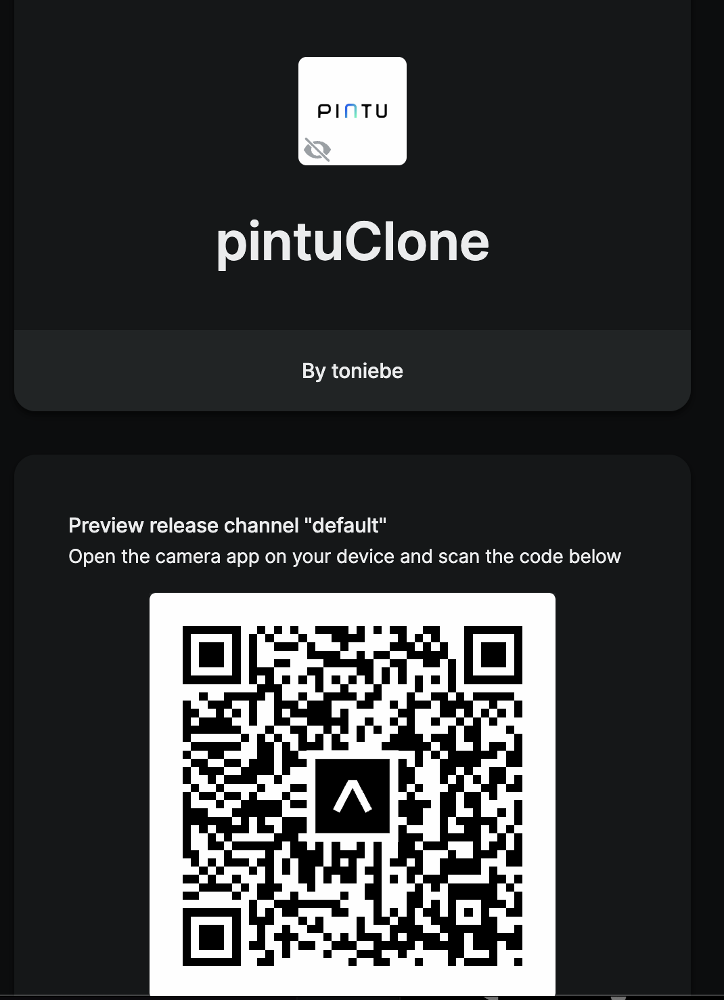

# Pintu Clone

"Pintu Clone App" is an application cloned from the "Pintu" app, which is about crypto investment application."

# Run Mobile Apps


<br/>

1. install expo go in you're app
2. scan QR code or you cant copy this link to expo go app
3. go to tab market for view list currency 

__Note__:

A bug occurred when running the application that has already been published on Expo, where the main page navigation is not recognized. Alternatively, you can click the back button in the navigation header.

# Run in web

1. open the link [pintu clone](https://pintuclone.netlify.app/market)
2. If you encounter a blank page, you can refresh the page or you can open it in an incognito tab.
3. For some reasons, websites are sometimes blocked by CORS permission. If you experience this problem, you can use this command in the terminal: `open -n -a /Applications/Google\ Chrome.app/Contents/MacOS/Google\ Chrome --args --user-data-dir="/tmp/chrome_dev_test" --disable-web-security`.

# Usage
1. clone the repository with command `git clone https://github.com/toniebe/pintuClone.git`
2. change directory to folder pintuClone with command `cd pintuClone`
3. install all dependencies with command ``` yarn install ```
4. run server with command ``` yarn start ```
5. or you can specific run platform with command ``` yarn android ``` for androin
5. ``` yarn ios ``` for run in ios
6. ``` yarn web ``` for running in web
7. You can go to the market tab to see the available currencies.
8. You can search in the search bar by entering the name of the blockchain


__Notes__: 

Other features, besides the market, are not available. Later, a component will be displayed to redirect to the gateway website.


